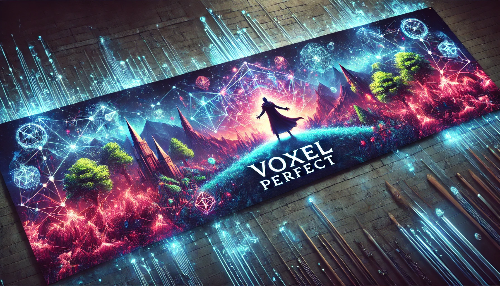

# Hi there, I'm Nayan Sinha! 👋

 <!-- Replace with actual image link -->

### 🚀 Imagination-fueled developer | Creative problem solver | Jugadu by nature

---

## 💭 Why I Code

The magic of being able to build *anything I can imagine* in a digital world is what pulled me into coding. What keeps me going is the thrill of learning something new every single day. For me, it's not just about technology—it's about crafting tools that genuinely improve lives.

---

## 🔧 What I’m Building

### 🧠 **TaskFlow AI** *(Passion Project)*

> Started as a vision, now evolving into a full-blown AI orchestration engine. TaskFlow breaks down high-level user tasks into subtasks, delegates them to specialized agents (e.g., a Web Surfer, PDF Viewer, Writer, etc.), and intelligently aggregates the results.
> It’s inspired by Manus AI, but I’m going further—building a system that's modular, independent of existing open-source agents, and one day, **tightly integrated into my custom OS**.

### 🖥️ **Custom Operating System**

> A deep-dive personal challenge to understand and control the stack from the ground up. The file system is already working, and more components are actively in development.
> The ultimate goal? To build a lean, efficient OS that supports AI workflows natively—no dependencies, no limits.

### 🌍 **Open-World Fantasy Game**

> Inspired by **Elden Ring** and **Assassin’s Creed**, this passion project features a magical medieval village, elemental bosses, branching quests, and immersive lore.
> Still deciding between **Unity (C#)** or **Unreal Engine**, but the vision is already alive.

### 📈 **Web Projects**

* **Voxella** (formerly Wishstack): A productivity + discovery web app. It got 50 users on the waitlist, 10 active users, and 2 paid subscribers for the premium tier.
* Multiple web experiments and MVPs that taught me frontend/backend/full-stack flows inside out.

### 🎮 **Games**

> I've built multiple games across genres—2D, 3D, top-down, multiplayer—you name it. Combined, they’ve attracted \~1K+ views. Each project taught me something new, from player controller logic to networking fundamentals.

---

## 💻 Tools I Love Using

* 🧠 **Languages**:
  
  
  
  

* 🧰 **Tech Stack**:
  
  
  
  

* 🌱 **Currently Learning**:
  **Operating System development** and **AI agent orchestration**.

---

## 🧪 Highlight Project

### ✨ TaskFlow AI

> This project is pushing me to level up across systems thinking, AI orchestration, and automation. It embodies everything I love: building useful systems from the ground up, challenging assumptions, and solving real problems with code.

---

## 🌟 A Little About Me

* 🎮 Gamer | 🎷 Music Lover | 🏃‍ Long walks enthusiast
* 🤝 I chose biology in 12th grade *because* I already knew how to code and wanted to explore something new
* 🎯 Dream: Intern with the **Linux Foundation**, and create a dev environment that’s truly mine from kernel to CLI
* 🧠 When I’m not coding, I’m going down YouTube rabbit holes or vibing with friends

---

## 🤝 Let’s Connect

> 💬 Discord: **captainsteve.**

---

## 🗣️ My Motto

**"Build with curiosity. Learn with intent. Share without fear."**

---

## ❤️ Final Note

I hope this README leaves you feeling inspired. If anything here resonates with you or sparks a project idea, hit me up—let’s collaborate.

